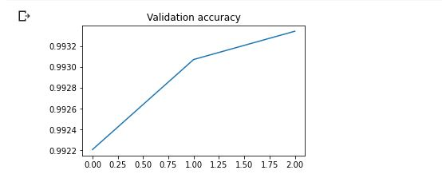
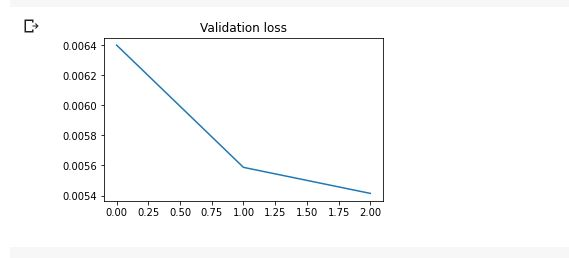

# Technical documentation

## Notebook work phases

### Data collection

The training data used for the project is a subset of the Reuters 1997 text categorization [dataset](https://www.cs.helsinki.fi/u/yangarbe/Courses/2020-deep-learning/text-training-corpus/).

The original compressed data consists of several XML files corresponding to articles that appeared on the Reuters news service. These XML files contain the ids, dates, languages, titles, topic codes and text bodies of said articles. Our interest were in selecting the text bodies and title codes from each article. The title codes are shorthand codes such as 'ECAT' for 'ECONOMICS' that denote the category/topic area of the article. Each article may have several topic codes.

After parsing the XML files using the XML data extraction features of BeautifulSoup the package, the data is saved in a pandas dataFrame for easier manipulation in Python. Some topic codes are discarded, as a predefined list of topic codes is used to decice which codes are saved alongside the bodytext into the dataFrame.

#### Data pre-processing

Prior to using the data, we still needed to clean the text bodies. All non alphabet symbols were removed and all of the text was converted to a lowercase representation. Using the NLTK 'wordnet' stopwords package for English, we also removed stopwords from the text in order to improve the accuracy of training our model. The WordNetLemmatizer from the NLTK package was also used to lemmatize the words, preventing the same word from appearing in multiple conjugations.

#### Encoding and Tokenizing Data

Using the MultilabelBinarizer and tokenizer from Keras, the cleaned binarized data was fit to a complete list of all the possible topic codes. We padded the encoded text sequences to be 1000 tokens long, while only taking a slice of the 1000 first tokens from those text sequences that would exceed this length. The encoders are also saved as pickles so there is no need to encode the data again if there are no changes.

#### LSTM model Neural Network

A LSTM recurrent neural network architecture was chosen due to its good suitability to classify and make predictions. ADAM (an adaptive learning rate optimization algorithm), was used to optimize the neural network instead of normal gradient descent that would have a fixed learning rate during training.The Sigmoid activation function was used for the output neuron as the project was a multilabel classification and each probability distribution of the neurons are independent of each other. As the loss function, mean squared error was found to work well.

#### Training the model

The model was trained using the cuda GPU option, speeding up the training process. A batch size of 32 was chosen empirically. The model was ran for 3 epochs as the result looked satisfactory.

#### Validation

We set a threshold of 0.5 to decide which values in the tensors in our output were likely to display certain topic codes.

F1-score is used to determine the accuracy of the prediction.

#### Results

Our training results and validation showed that the model itself reaches a very high level of accuracy when it comes to predicting the correct labels of the articles. With only 1 training epoch, our model attained an accuracy of over *0.99*, with a loss value of less than *0.01*. Thus, we would classify our model to be often successful in determining the correct topic codes for articles.
 
Here are the [results of training](./documentation/training_results.txt) the model for 3 epochs. In the following charts, you can see the changes in the loss and accuracy of the model within the first epoch when the model was trained using the whole dataset.

# Future research and experimentation

In the case that more research and time would be spent working on this project, here are some of our ideas on what could be the focus of further work.

Due to the current training data containing only 299773 records, and only containing *103* of the topic codes included within the list of topic codes,  it would be interesting to attempt to train the model using the whole  ~850K article Reuters dataset that should contain all the *126* codes included in **topic_codes.txt**, and compare the accuracy and losses of training with both these datasets. 

Another interesting take on the experiment would be to test whether selecting certain text features from the article body texts would perform better than selecting all the text. Noun or verb phrase extraction could be used to only use the nouns in the text bodies, and the stopwords that were used could be added to and customized also for the task. Also, the cut-off thresholds used to interpret the probability for a label could be experimented on, testing whether a value other than 0.5 performs better.

As for more general experiments that could be performed, testing the use of traditional machine learning methods could be compared to the results currently gained from deep learning methods. Topic modeling techniques such as LDA (Latent Dirichlet Allocation) or logistic regression and their effectiveness at classifying the data could also be tested.

In this notebook, the **pyTorch** package was used. It would be interesting to see how using **TensorFlow**, **Keras** or some other deep learning package would perform compared to the current implementation. The novel method of Sequence to sequence modelling could also have been used for training the data. Testing the use of transfer learning in the classification of text data could be experimented with BERT (Bidirectional Encoder Representations from Transformers).
